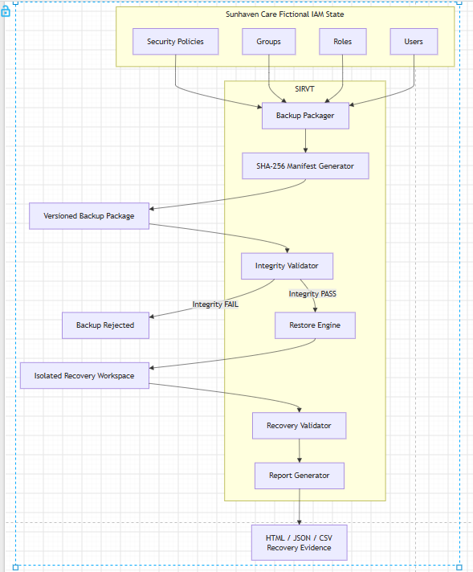

# SIRVT Architecture

## Sunhaven IAM Recovery and Resilience Validation Toolkit

SIRVT is a standalone cybersecurity resilience tool developed for the fictional Sunhaven Care environment.

The project focuses on the recoverability and integrity of important Identity and Access Management (IAM) configuration.

---

## 1. Sunhaven Care Problem

Sunhaven Care has a high-turnover workforce that includes permanent employees, casual workers and agency workers.

Its IAM environment is responsible for controlling access to sensitive systems and resident information through users, roles, groups and security policies.

The wider Sunhaven project already addresses important access-control problems such as:

- users joining, changing roles and leaving the organisation;
- accounts remaining active after workers leave;
- workers retaining access they no longer require;
- excessive access to sensitive information;
- shared-device risks;
- role-based access control;
- MFA; and
- access review and auditing.

However, protecting access is only one part of cybersecurity.

Sunhaven also needs to consider what happens if important IAM configuration is:

- accidentally deleted;
- incorrectly modified;
- corrupted;
- incompletely backed up;
- restored from an invalid backup; or
- only partially recovered after a failure.

For example, a role definition could be accidentally removed, a security group could be modified, or an IAM configuration file could become corrupted.

If Sunhaven cannot identify a valid recovery copy, restoring damaged or incomplete information could create additional security problems.

---

## 2. Security Gap

Existing IAM controls such as MFA, RBAC and account lifecycle management help reduce unauthorised access.

However, these controls do not answer an important resilience question:

> If Sunhaven's IAM security state is damaged, can a verified recovery copy be safely restored?

A backup is not automatically suitable for recovery simply because it exists.

A damaged, incomplete or modified backup should not be restored without verification.

Sunhaven therefore requires a method to:

1. create a recovery copy of important IAM state;
2. record expected file information and SHA-256 values;
3. verify that the backup still matches the stored manifest;
4. reject a backup when integrity verification fails;
5. restore only a verified backup into an isolated workspace;
6. confirm that the expected IAM state was recovered; and
7. produce evidence showing the recovery result.

---

## 3. Proposed Solution

The proposed solution is the **Sunhaven IAM Recovery and Resilience Validation Toolkit (SIRVT)**.

SIRVT is planned as a local Python-based cybersecurity tool that operates on a fictional Sunhaven IAM dataset.

The toolkit is designed to:

- create versioned backups of fictional Sunhaven IAM configuration;
- generate SHA-256 hashes for protected files;
- create a backup manifest containing expected file information;
- verify backup integrity before restoration;
- identify modified or missing files;
- block recovery when integrity verification fails;
- restore a verified backup into an isolated recovery workspace;
- compare the recovered state with the expected state;
- calculate recovery completeness;
- measure controlled recovery duration; and
- produce recovery evidence and reports.

SIRVT does not modify the live Microsoft Entra ID tenant used by the group project.

It uses independent fictional data so that development, testing and demonstration can be completed safely without depending on another team member's work.

---

## 4. How SIRVT Helps Sunhaven Care

SIRVT adds a cyber-resilience capability to the wider Sunhaven Care cybersecurity project.

### 4.1 Detects Unexpected Backup Changes

SIRVT is designed to calculate SHA-256 hashes when a backup is created.

When the backup is later checked, new hashes will be calculated and compared with the values recorded in the backup manifest.

If a protected file has changed unexpectedly, SIRVT will report an integrity failure.

Example:

```text
users.json       PASS
roles.json       FAIL
groups.json      PASS
policies.json    PASS
```

This allows the toolkit to identify that `roles.json` no longer matches the expected backup state.

### 4.2 Prevents Recovery From a Failed Integrity Check

A backup that fails verification should not continue to the restore stage.

The planned behaviour is:

```text
Integrity PASS
      |
      v
Restore permitted
```

and:

```text
Integrity FAIL
      |
      v
Restore blocked
```

This prevents the recovery process from knowingly restoring backup data that has failed the integrity check.

### 4.3 Uses an Isolated Recovery Workspace

A verified backup will be restored into a local recovery workspace rather than directly overwriting the original source data.

This keeps testing controlled and allows the recovered state to be checked before any further action.

### 4.4 Validates Recovery Completeness

SIRVT is designed to check whether the expected IAM files and objects are present after restoration.

The recovered state can then be compared with the expected state to determine whether recovery was complete.

### 4.5 Produces Recovery Evidence

The final toolkit is intended to record evidence such as:

- backup selected;
- files checked;
- integrity result;
- restore result;
- recovered object counts;
- recovery completeness; and
- recovery duration.

This provides measurable evidence that can be used in testing and demonstration.

---

## 5. Fictional IAM State

The current SIRVT data model contains four fictional JSON files:

```text
data/
├── users.json
├── roles.json
├── groups.json
└── policies.json
```

These files represent a small and controlled Sunhaven IAM state.

### `users.json`

Contains fictional Sunhaven users and basic account information.

### `roles.json`

Defines the fictional roles referenced by users.

### `groups.json`

Defines fictional security groups and their assigned roles.

### `policies.json`

Defines simplified fictional IAM security policies.

The dataset is intentionally small so that backup, corruption and recovery behaviour can be demonstrated clearly.

No real Microsoft Entra ID data, passwords, authentication tokens, tenant secrets or resident information are used.

---

## 6. High-Level Architecture




## 7. Architecture Flow

The planned workflow is:

1. SIRVT reads the fictional Sunhaven IAM state.
2. A versioned backup is created.
3. SHA-256 values are generated and recorded in a manifest.
4. The backup is checked before recovery.
5. A backup that fails integrity verification is rejected.
6. A backup that passes verification can be restored into an isolated workspace.
7. The recovered state is checked for completeness.
8. The final recovery result is recorded as evidence.

---

## 8. Relationship to the Wider Project

The wider Sunhaven Care project focuses on operating and governing identities and access.

SIRVT focuses on recovery and resilience.

The distinction is:

```text
Sunhaven Workforce IAM
        |
        v
Control and govern access

SITAS
        |
        v
Analyse identity attack paths

SIRVT
        |
        v
Validate recovery integrity and recoverability
```

SIRVT does not implement Joiner-Mover-Leaver automation, live Entra provisioning, access review, workforce compliance checking, security monitoring or shared-device session assurance.

This keeps the technical contribution separate from the other Sunhaven workstreams.

---

## 9. Current Architecture Status

The architecture and fictional IAM state have been defined.

The Python backup, integrity-verification, restore, recovery-validation and reporting components are planned but have not yet been implemented.

The next implementation step is to load and validate the four IAM JSON files before backup creation begins.
